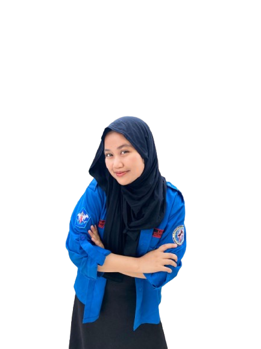

<!DOCTYPE html>
<html lang="en">
<head>
  <meta charset="UTF-8" />
  <meta name="viewport" content="width=device-width, initial-scale=1.0" />
  <title>Dilla's Portfolio</title>
  <link href="https://fonts.googleapis.com/css2?family=Inter:wght@400;700&display=swap" rel="stylesheet">
  
</head>
<body>

  <header>
    <h1>👋 Hi, I'm Dilla</h1>
    
Marine Info Systems | Tech Enthusiast | Ocean Lover

  </header>

  

    

      
      

        

          I am a Marine Information System student at Universitas Pendidikan Indonesia with a great interest in technology, especially in project and product management, in addition to my interest in marine and fisheries.
        

        

          As a generalist, I enjoy learning new things, adapt quickly, and have good analytical skills in solving problems. I have experience in marine data analysis using various software, active in research activities, and contributing to organizations that focus on public relations.
        

        

          This involvement strengthens my communication and collaboration skills in various cross-disciplinary teams. I am always open to new opportunities, both for collaboration and professional development.
        

        
Contact me via LinkedIn or email to collaborate!

      

    

    

      <h2>🧠 Projects</h2>
      <ul>
        <li><strong>Mapping Seagrass Ecosystem:</strong> Using Landsat 8 & SVM</li>
        <li><strong>Coral Reef Fish Classification:</strong> MOGANET-T Model (90%+ accuracy)</li>
      </ul>
    

    

      <h2>🌐 Connect with Me</h2>
      <a href="https://instagram.com/dillamysr_" target="_blank">Instagram</a>
      <a href="https://linkedin.com/in/dillamayasari" target="_blank">LinkedIn</a>
      <a href="mailto:dillamaya2022@gmail.com">Email</a>
      <a href="https://www.academia.edu/yourusername" target="_blank">Academia.edu</a>
      <a href="https://kompas.id/yourakun" target="_blank">Kompas Profile</a>
    

  

  <footer>
    © 2025 Dilla Mayasari. Made with 💙 for tech & ocean.
  </footer>

</body>
</html>
